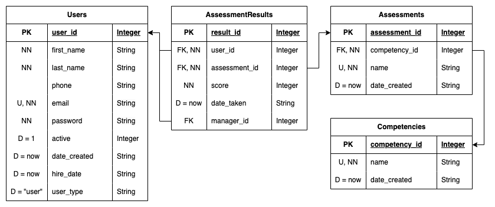

# Competency Tracker

## Login Info
### Manager
> Email: admin
> Password: 123
### User
> Email: user
> Password: 123

---

## How To Use
### Main Menu
From here you can get to 4 **sub-menus**, one for each of the differenct entities, or **import** a CSV.
### Users Menu
From here you can **view** or **search** all of the users, **add** both users and managers, or **reactivate** a user.
> #### User Menu
> This menu allows you to **edit**, **view** reports, **add** an assessment result to, or **deactivate** the currently selected user
### Competencies Menu
From here you can **view** or **add** a competency
> #### Competency Menu
> This menu allows you to **edit**, or **view** a report for the currently selected competency
### Assessments Menu
From here you can **view** or **add** an assessment
> #### Assessment Menu
> This menu allows you to **edit** the currently selected assessment
### Assessment Results Menu
From here you can **view** or **export** all of the results
> #### Assessment Result Menu
> This menu allows you to **edit** or **delete** the selected result

---

* From the view windows, it may prompt you for a selection ID, which will take you to the corresponding selections menu. You may also leave the prompt blank, and you will go back to the previous menu.
* In any menu, you can either enter menu item 0, or just press enter and you will go back to the previous menu/quit the application.

---

## CSV
A file called `ar.csv` includes assignment results that can be imported using the import csv option in the main menu.

---

## ERD
